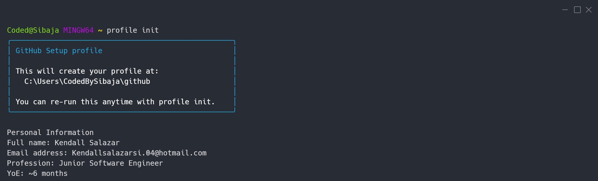

## 

A junior software engineer who is constantly evolving and looking for opportunities to continue learning and improving over time. I’m open to any kind of tech job or project, so if you’d like to collaborate, just reach out to me. I’m a quick learner; I’m familiar with APIs, frameworks, and cloud services, and if there’s something I don’t know, I research it and put it into practice. Oh, right! I’ve started jumping on the AI bandwagon, so I’m also working on MCP topics, AI integrations, and things like that.

## Stack / Technologies

## Projects

- [x] First repo of user created
- [ ] Project 1 — [Create my professional website to offer my services and get visibility]
- [ ] Project 2 — [Not yet]

[Look at my entire roadmap in GitHub Projects →](https://github.com/users/CodedBySibaja/projects/1)

## Contact me

<kbd>Email</kbd> = <kbd>Kendallsalazarsi.04@hotmail.com</kbd>
 
<kbd>LinkedIn</kbd> = <kbd>kendallsys</kbd>

📅 *Last update: September 2026*

